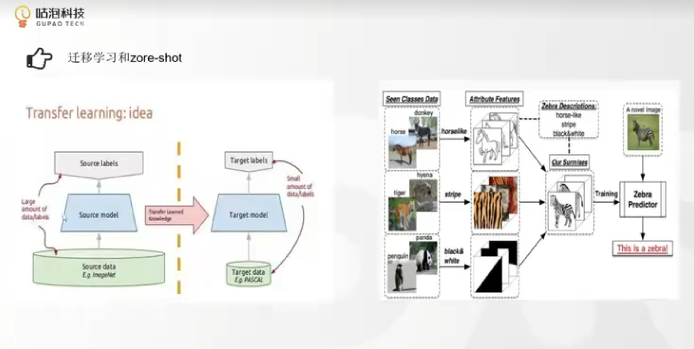
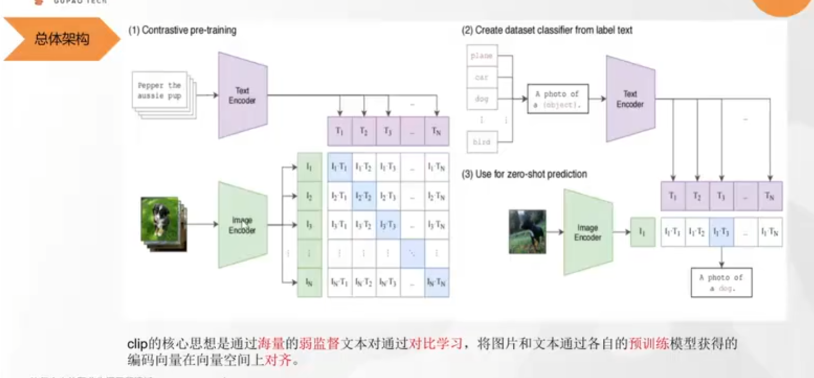
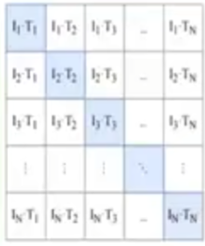
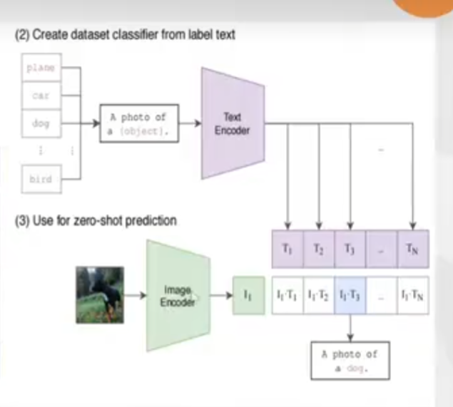

对齐：多模态中的对齐就是在把各个模态嵌入的向量，在一个高维空间
中可以去让其更加靠近一个点（也就是让一个点来表示多个模态的信息），目前最好就是让其能向着一个点聚拢。

迁移学习：简单来说就是在一个大的数据集上训练的模型，我们拿过来在自己的任务数据集上跑一下，改点参数之类的。
zore-shot：就是说保证原来训练的模型，我们现在给他一些文本描述之类，让其能够完成预测。举例：比如之前在imgnet上训练了很多动物的分类，但是没有斑马的分类
，斑马的特征在之前训练的数据集上又是有体现的，所以我们现在说一下斑马的特征，模型能够分类出斑马。

clip：

通过文本和图像的数量是一样的，并且一一对齐了。现在通过imageEncoder（这里可以是一个ResNet，VAT等CV特征提取的网络），文本也是通过
TextEncoder（这个可以是Bert等文本处理的模型），然后转换成向量。矩阵的主对角线就是正样本，其他就是负样本，正样本因为是一一对应的
图片和文本。通过
这个矩阵和对应的标签值的一个只有对角线为1的其余为0的单位矩阵，两个矩阵做反向传播，从而逼着imageEncoder
和TextEncoder修改其中的网络参数，让其两个部分编码处出来的向量能够尽可能的对齐。
这里有一个需要注意的是，因为在这个数据集里面不可能只有一个狗，应该是还有一些的，但是我们要让其对角线是正样本，其他地方为负样本为0，这里就是
有问题的，所以只能通过加大样本集合和批次来让其尽可能加速的收敛，让其有噪声，和标签不是那么正确也可以收敛。

现在就是通过把很多的文本，通过刚才训练得到的TextEncoder得到向量，